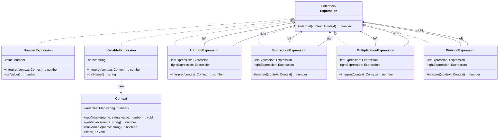

# Interpreter Pattern

## Overview

The **Interpreter Pattern** is a behavioral design pattern that defines a representation for a grammar of a language and provides an interpreter to process sentences in that language. It's useful for implementing domain-specific languages (DSL), mathematical expression evaluators, query processors, and rule engines.

## Intent

- **Define a grammar** for a simple language and provide an interpreter for sentences in that language
- **Map domain problems** to a language representation
- **Parse and evaluate** expressions using a tree structure
- **Support extensible languages** by adding new expressions easily

## When to Use

✅ **Use the Interpreter Pattern when:**
- You need to implement a domain-specific language (DSL)
- You have a grammar that can be represented as a tree structure
- The grammar is relatively simple and stable
- Performance is not the primary concern
- You need to parse and evaluate mathematical expressions
- You're building a rule engine or query processor

❌ **Avoid when:**
- The grammar is complex and changes frequently
- Performance is critical (interpreters are typically slower than compiled solutions)
- You need advanced parsing features (use a parser generator instead)
- The language requires complex error handling and recovery

## Structure

### UML Class Diagram



## Key Components

### 1. Expression Interface
```typescript
interface Expression {
    interpret(context: Context): number;
}
```
- Defines the `interpret` method that all expressions must implement
- Forms the basis of the composite structure

### 2. Context Class
```typescript
class Context {
    private variables: Map<string, number>;
    // Methods for variable management
}
```
- Stores global state during interpretation
- Manages variable assignments and lookups
- Can be extended to store additional context information

### 3. Terminal Expressions
- **NumberExpression**: Represents numeric literals
- **VariableExpression**: Represents variable references
- These are leaf nodes in the expression tree

### 4. Non-Terminal Expressions
- **AdditionExpression**: Represents addition operations
- **SubtractionExpression**: Represents subtraction operations
- **MultiplicationExpression**: Represents multiplication operations
- **DivisionExpression**: Represents division operations
- These contain references to other expressions (composite pattern)

## Implementation Details

### Project Structure
```
interpreter/
├── interfaces/
│   └── expression.ts
├── context/
│   └── context.ts
├── expressions/
│   ├── terminal/
│   │   ├── number-expression.ts
│   │   └── variable-expression.ts
│   └── non-terminal/
│       ├── addition-expression.ts
│       ├── subtraction-expression.ts
│       ├── multiplication-expression.ts
│       └── division-expression.ts
├── interpreter-main.ts
└── README.md
```

### Basic Usage Example

```typescript
import { Context } from './context/context';
import { NumberExpression } from './expressions/terminal/number-expression';
import { VariableExpression } from './expressions/terminal/variable-expression';
import { AdditionExpression } from './expressions/non-terminal/addition-expression';

// Create context and set variables
const context = new Context();
context.setVariable('x', 10);
context.setVariable('y', 5);

// Build expression: x + y + 20
const expression = new AdditionExpression(
    new AdditionExpression(
        new VariableExpression('x'),
        new VariableExpression('y')
    ),
    new NumberExpression(20)
);

// Interpret the expression
const result = expression.interpret(context);
console.log(`Result: ${result}`); // Output: Result: 35
```

### Advanced Usage with Expression Builder

```typescript
import { ExpressionBuilder } from './interpreter-main';

// Using the fluent builder interface
const expression = ExpressionBuilder.add(
    ExpressionBuilder.multiply(
        ExpressionBuilder.variable('x'),
        ExpressionBuilder.number(2)
    ),
    ExpressionBuilder.divide(
        ExpressionBuilder.variable('y'),
        ExpressionBuilder.number(3)
    )
);

// This represents: (x * 2) + (y / 3)
```

## Running the Examples

```bash
# Navigate to the interpreter directory
cd design-pattern-ts/behavioural/interpreter

# Run the main example
npx ts-node interpreter-main.ts
```

## Example Output

```
============================================================
INTERPRETER PATTERN DEMONSTRATION
============================================================

1. Context Setup:
Context: { x = 10, y = 5, z = 2 }

2. Simple Number Expression:
Expression: 42
Result: 42

3. Variable Expression:
Expression: x
Result: 10

4. Simple Addition:
Expression: (x + y)
Result: 15

5. Complex Expression:
Expression: ((x + y) * z)
Result: 30

6. Very Complex Expression:
Expression: (((x + y) * z) - (x / y))
Result: 28

7. Expression with Numbers and Variables:
Expression: ((x + 100) / (y - 2))
Result: 36.666666666666664

8. Changing Context Values:
Updated context: { x = 20, y = 10, z = 2 }
Same expression with new values: 10

9. Error Handling - Division by Zero:
Expression: (10 / 0)
Error caught: Division by zero: 10 / 0

10. Variable Not Found Warning:
Expression: undefined_var
Variable 'undefined_var' not found in context. Using default value 0.
Result: 0
```

## Real-World Applications

### 1. Mathematical Expression Calculator
```typescript
// Calculator that evaluates mathematical expressions
const formula = ExpressionBuilder.add(
    ExpressionBuilder.multiply(
        ExpressionBuilder.variable('principal'),
        ExpressionBuilder.variable('rate')
    ),
    ExpressionBuilder.variable('fees')
);

// Calculate interest for different scenarios
const scenarios = [
    { principal: 10000, rate: 0.05, fees: 50 },
    { principal: 25000, rate: 0.04, fees: 75 }
];
```

### 2. Business Rule Engine
```typescript
// Rule: discount = (basePrice * discountRate) - membershipBonus
const discountRule = ExpressionBuilder.subtract(
    ExpressionBuilder.multiply(
        ExpressionBuilder.variable('basePrice'),
        ExpressionBuilder.variable('discountRate')
    ),
    ExpressionBuilder.variable('membershipBonus')
);
```

### 3. Configuration Expression Evaluator
```typescript
// Dynamic configuration evaluation
const configExpression = ExpressionBuilder.add(
    ExpressionBuilder.variable('baseMemory'),
    ExpressionBuilder.multiply(
        ExpressionBuilder.variable('users'),
        ExpressionBuilder.variable('memoryPerUser')
    )
);
```

## Benefits

### ✅ Advantages
1. **Easy to Change and Extend**: Adding new expressions is straightforward
2. **Grammar Representation**: Clear mapping between grammar rules and classes
3. **Flexibility**: Expressions can be combined in any valid way
4. **Reusability**: Expressions can be reused in different contexts
5. **Testability**: Each expression can be tested independently

### ❌ Disadvantages
1. **Complex Grammars**: Can become unwieldy for complex languages
2. **Performance**: Interpretation is slower than compilation
3. **Memory Usage**: Creates many small objects for complex expressions
4. **Limited Error Handling**: Basic error reporting compared to full parsers

## Comparison with Other Patterns

| Pattern | Purpose | When to Use |
|---------|---------|-------------|
| **Interpreter** | Execute language expressions | Simple DSLs, mathematical expressions |
| **Strategy** | Select algorithms at runtime | Different behaviors for same operation |
| **Command** | Encapsulate requests as objects | Undo/redo, queuing, logging operations |
| **Visitor** | Add operations to object structures | Operations on complex object hierarchies |

## Best Practices

### 1. **Keep Grammar Simple**
```typescript
// Good: Simple, focused expressions
class AdditionExpression implements Expression {
    interpret(context: Context): number {
        return this.left.interpret(context) + this.right.interpret(context);
    }
}

// Avoid: Complex expressions with multiple responsibilities
```

### 2. **Use Builder Pattern for Complex Expressions**
```typescript
// Provides a fluent interface for building expressions
const expression = ExpressionBuilder
    .add(
        ExpressionBuilder.variable('x'),
        ExpressionBuilder.number(10)
    )
    .multiply(ExpressionBuilder.variable('y'));
```

### 3. **Implement Proper Error Handling**
```typescript
class DivisionExpression implements Expression {
    interpret(context: Context): number {
        const denominator = this.right.interpret(context);
        if (denominator === 0) {
            throw new Error('Division by zero');
        }
        return this.left.interpret(context) / denominator;
    }
}
```

### 4. **Consider Caching for Performance**
```typescript
class CachedExpression implements Expression {
    private cache: Map<string, number> = new Map();
    
    interpret(context: Context): number {
        const key = this.generateKey(context);
        if (this.cache.has(key)) {
            return this.cache.get(key)!;
        }
        const result = this.doInterpret(context);
        this.cache.set(key, result);
        return result;
    }
}
```

## Extensions and Variations

### 1. **Adding New Operations**
To add a new operation (e.g., power/exponentiation):

```typescript
class PowerExpression implements Expression {
    constructor(
        private base: Expression,
        private exponent: Expression
    ) {}

    interpret(context: Context): number {
        return Math.pow(
            this.base.interpret(context),
            this.exponent.interpret(context)
        );
    }
}
```

### 2. **Type-Safe Expressions**
```typescript
interface TypedExpression<T> {
    interpret(context: Context): T;
    getType(): string;
}

class BooleanExpression implements TypedExpression<boolean> {
    interpret(context: Context): boolean {
        // Implementation
    }
    
    getType(): string {
        return 'boolean';
    }
}
```

### 3. **Expression Optimization**
```typescript
interface OptimizableExpression extends Expression {
    optimize(): Expression;
}

class AdditionExpression implements OptimizableExpression {
    optimize(): Expression {
        // Optimize: 0 + x = x, x + 0 = x
        if (this.isZero(this.left)) return this.right;
        if (this.isZero(this.right)) return this.left;
        return this;
    }
}
```

## Testing Strategy

### Unit Testing Individual Expressions
```typescript
describe('NumberExpression', () => {
    it('should return the correct value', () => {
        const expr = new NumberExpression(42);
        const context = new Context();
        expect(expr.interpret(context)).toBe(42);
    });
});

describe('AdditionExpression', () => {
    it('should add two expressions correctly', () => {
        const left = new NumberExpression(10);
        const right = new NumberExpression(5);
        const expr = new AdditionExpression(left, right);
        const context = new Context();
        expect(expr.interpret(context)).toBe(15);
    });
});
```

### Integration Testing Complex Expressions
```typescript
describe('Complex Expressions', () => {
    it('should evaluate nested expressions correctly', () => {
        const context = new Context();
        context.setVariable('x', 10);
        context.setVariable('y', 5);
        
        // (x + y) * 2
        const expr = new MultiplicationExpression(
            new AdditionExpression(
                new VariableExpression('x'),
                new VariableExpression('y')
            ),
            new NumberExpression(2)
        );
        
        expect(expr.interpret(context)).toBe(30);
    });
});
```

## Conclusion

The Interpreter Pattern is powerful for implementing domain-specific languages and expression evaluators. While it may not be suitable for complex grammars due to performance considerations, it excels in scenarios requiring:

- Simple mathematical expression evaluation
- Business rule engines
- Configuration expression processing
- Query language interpretation

The pattern provides excellent extensibility and maintainability for the right use cases, making it a valuable tool in the software architect's toolkit.

## Related Patterns

- **Composite Pattern**: Used for building the expression tree structure
- **Visitor Pattern**: Alternative for adding operations to expression trees
- **Builder Pattern**: Helpful for constructing complex expressions
- **Strategy Pattern**: Can be used for different interpretation strategies
- **Flyweight Pattern**: Can optimize memory usage for repeated sub-expressions
